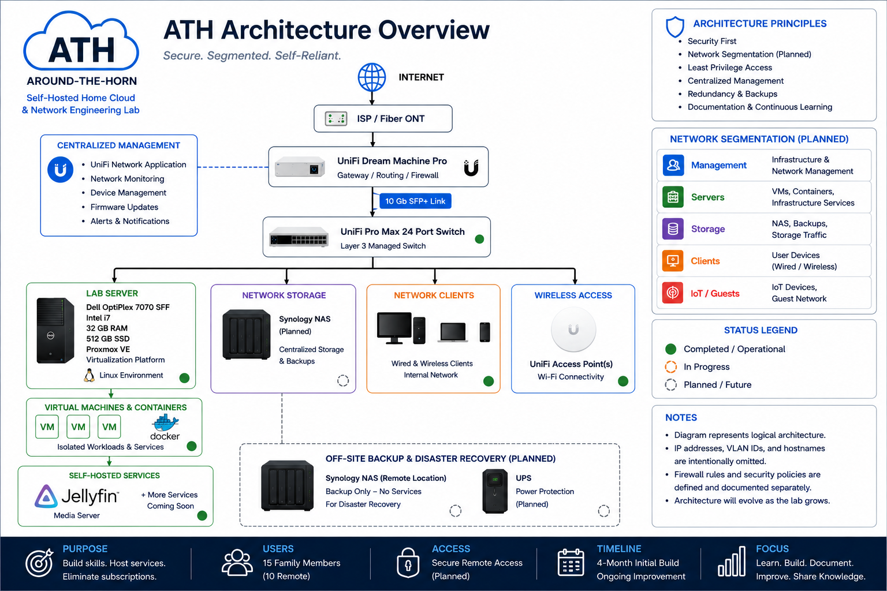

# Around-The-Horn
**A self-hosted home cloud and network engineering lab built from the ground up.**

Around-The-Horn (ATH) is a hands-on infrastructure project focused on designing, deploying, securing, and documenting a self-hosted environment using enterprise-style networking, virtualization, Linux, containers, and centralized storage.

The project combines real-world hardware with practical network and systems engineering. Rather than simply deploying individual applications, ATH is being built as an interconnected environment where routing, switching, segmentation, compute, storage, security, and remote access are designed to work together.

> **Project Status:** 🚧 Active Development

## Architecture Overview

*Logical overview of the ATH environment. Sensitive addressing, VLAN identifiers, hostnames, credentials, and detailed security configurations are intentionally excluded from this public repository.*

## Project Goals

Around-The-Horn is being developed with several long-term goals:

- Build hands-on experience with network engineering, virtualization, Linux, Docker, storage, and infrastructure security.
- Design a segmented network that separates infrastructure, servers, trusted clients, IoT devices, guests, and lab environments.
- Deploy self-hosted services while maintaining control over data, access, and security.
- Provide secure remote access for authorized users without unnecessarily exposing internal infrastructure.
- Implement centralized storage and a backup strategy that can eventually include off-site disaster recovery.
- Build an environment that can grow as hardware, bandwidth, services, and technical requirements change.
- Document the complete process, including design decisions, deployment, testing, troubleshooting, failures, and lessons learned.

## Technology & Infrastructure

ATH combines physical infrastructure with virtualization and self-hosted software to create a complete lab environment.

### Networking

- Ubiquiti UniFi gateway and routing platform
- Ubiquiti UniFi managed switching
- 10 GbE SFP+ connectivity between core network devices
- Cat6/Cat6A structured Ethernet cabling
- Planned VLAN-based network segmentation
- Centralized firewall and network management

### Compute & Virtualization

- Dell OptiPlex 7070 SFF dedicated lab server
- Proxmox Virtual Environment
- Linux virtual machines
- Docker containerization

### Storage & Backup

- Synology network-attached storage
- Centralized file and application storage
- Local backup strategy
- Planned off-site disaster recovery

### Services

- Jellyfin media server
- Self-hosted applications and services
- Secure remote access
- Additional services deployed as the lab evolves

### Security

- Planned network segmentation
- Planned firewall-based inter-VLAN access control
- Restricted infrastructure management
- Secure credential handling
- Controlled remote access
- Configuration and data backups

## Project Documentation

Detailed documentation is maintained throughout the repository as ATH is designed, deployed, tested, and expanded.

### Architecture & Design

- [Architecture Overview](docs/architecture/overview.md) — High-level overview of the ATH environment, infrastructure layers, project goals, and design philosophy.
- [Network Architecture](docs/network/network-architecture.md) — Network design, core connectivity, segmentation strategy, remote access approach, physical infrastructure, and security considerations.
- [Security Design](docs/security/security-design.md) — Current and planned security controls, access management, segmentation strategy, data protection, and infrastructure hardening.

### Build Logs

- [Build Log 01 — Initial Infrastructure](docs/build-log/01-initial-infrastructure.md)
- [Build Log 02 — Network Deployment & Troubleshooting](docs/build-log/02-network-deployment.md)
- [Build Log 03 — Proxmox & Linux Deployment](docs/build-log/03-proxmox-linux-deployment.md)
- [Build Log 04 — Jellyfin Deployment & Validation](docs/build-log/04-jellyfin-deployment.md)

Additional documentation will be added as ATH evolves and new infrastructure, services, and security controls are implemented.

## Project Roadmap

ATH is being developed in phases. The roadmap below reflects the current state of the environment and will be updated as components are deployed and validated.

### ✅ Completed

- Deploy core Ubiquiti gateway
- Deploy managed Ubiquiti switch
- Establish SFP+ connectivity between core network devices
- Deploy dedicated Dell OptiPlex 7070 SFF lab server
- Install Proxmox virtualization platform
- Deploy initial Linux environment
- Deploy initial Jellyfin media service
- Establish GitHub repository and project documentation

### 🚧 In Progress

- Expand structured Ethernet cabling
- Develop virtualization and container environment
- Build out self-hosted services
- Document network and infrastructure architecture
- Develop secure storage architecture

### 📋 Planned

- Implement VLAN-based network segmentation
- Develop inter-VLAN firewall policies
- Deploy centralized network-attached storage
- Implement secure remote access architecture
- Expand backup and recovery strategy
- Deploy off-site disaster recovery
- Continue infrastructure monitoring and security hardening
- Document testing, troubleshooting, and lessons learned
